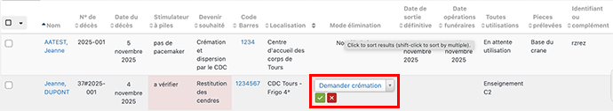

# Préparez le départ du corps vers le funérarium
Il s'agit de demander la crémation, de completer la base avec les informations funéraires, et de prévenir la PAQPF de la date de la crémation.

## Demandez la crémation 
Affichez le tableau de bord des corps présents : **Corps et pièces anatomiques > Tableau de bord des corps présents**

Vérifiez :

* qu'un éventuel simulateur à piles a bien été retiré
* les souhaits funéraires du donneur
* Dans le cas d'un souhait de restitution ou de l'absence de souhait exprimé par le donneur, la volonté de la PAQPF de récupérer ou non les cendres ou le corps

Dans le tableau:

* modifiez **Mode d'élimination** de *Non Eliminée* à *Demander Crémation*,
* un message est adressé au prestataire funéraire afin qu'il prévoie le transport et la crémation et indique la date de crémation,
* **Mode d'élimination** passe de *Demander Crémation* à *Crémation demandée*.

> Attention à bien valider en cliquant la coche verte, sinon la demande n'est pas effective

## Completez les informations funéraires
Lorsque le prestataire vous indique la date prévue de la crémation, completez la base. 
Dans le **Résumé** de la fiche donneur, ajoutez dans le bloc **Opérations funéraires réalisées** la date et le type d'opérations funéraires.

## Contactez la mairie du centre de don
Afin de demander l'autorisation de fermeture de cercueil et de transport, depuis la fiche donneur, **Action > Créer CiviOffice document** : 042-OPP_FUN-demande_auto_fermeture_et_cremation.

## Prévenez la PAQPF de la date de la crémation
Apres avoir vérifié:

* le souhait du donneur en matière d'opérations funéraires (restitution ou non)
* que le donneur ne s'est pas opposé à ce que ses proches soient prévenus de la date de la crémation
* en cas de demande de restitution par le donneur ou de l'absence de volonté, la volonté de la PAQPF de prendre en charge les cendres du donneur

### Si une restitution est prévue
C'est à dire si c'est le souhait du donneur souhait du donneur ET que la PAQPF souhaite récupérer les cendres, le courrier informe la PAQPF de la date de crémation et des modalités de restitution.

depuis la fiche donneur, **Action > Créer CiviOffice document** :  044-OPP_FUN-info_date_cremation_avec_restitution

### En l'absence de restitution 
C'est à dire si c'est le souhait du donneur OU que la PAQPF refuse de prende les cendres en charge, le courrier informe la PAQPF de la date de la crémation.

depuis la fiche donneur, **Action > Créer CiviOffice document** :  046-OPP_FUN-info_date_cremation_sans_restitution
