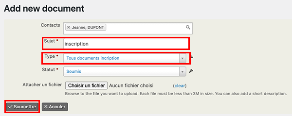

# Complétez la fiche Donneur
Entrez les informations concernant le donneur et sa promesse de don.
## Onglet Résumé
Completez les blocs :

* **Etat civil**
* **Adresse**
* **Antécédents médicaux si vous les connaissez**, notamment la présence d'un stimulateur à pile cardiaque ou neurologique.
* **Promesse de don** : centre, numéro et date d'inscription et choix du donneur concernant les opérations funéraires et les cérémonies.
> Attention : il n'y a pas d'incrément automatique du n° d'inscription; vous devez gérez vous-même les numéros de carte

## Onglet Documents
Cet ongle affiche les documents que vous avez téléchargé dans le dossier du Donneur : Promesse de don, Certificat de décès, RGPD...
> Attention : les documents et courriels générés par le système s'affichent, eux, dans l'onglet **Activités**

* Cliquez sur **Nouveau/Nouvelle document**
* Renseignez le sujet et le type de document, puis cliquez sur **Choisir un fichier** pour uploader le document à intégrer.
* Une fois soumis, le document s'affiche dans la liste des documents consultables.

>Attention la taille de chaque Document est limitée à 3Mo

## Onglet Relations
Cet onglet liste les relation du donneur avec d'autre contact : personne référente 1, personne référente 2, Personne ayant qualité pour pourvoir aux funérailles (PAQPF)
Cet autre contact peut aussi être donneur ou un proche de donneur. Dans ce cas, il fut créer la fiche **Proche de donneur** préalablement à le relation.
### Création de la fiche *Proche de donneur*
* Allez à **Contacts > Nouveau Proche de Donneur**, entrer les informations et **Enregistrer**
* Dans la fiche qui s'ouvre, complétez les coordonnées : adresse, courriel, téléphone.
### Création de la relation
* La relation peut être crées dans la fiche du donneur ou du proche, il faut juste faire atention à son sens.
* **Onglet Relations > Ajouter une Relation**
* Choisir le type de relation en prenant garde à sa direction;
>Ne définir qu'une relation de type *Personne référente* ou *Personne référente 2* ou *PAQPF* par donneur
* Choisir le contact en relation avec celui sur lequel vous travaillez
>Pour afficher les contacts vous pouvez utiliser le caractère générique % qui remplace tout caractère. 
