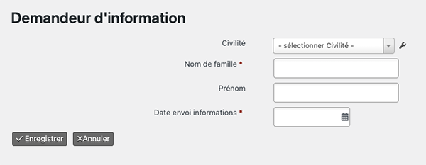
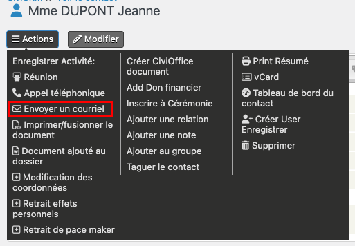
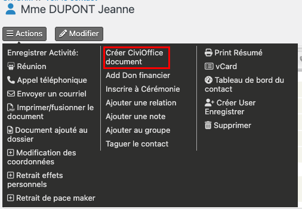
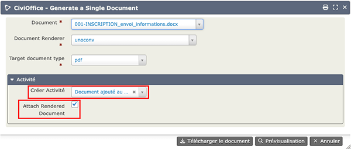
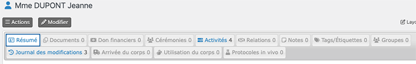
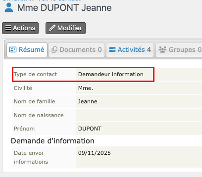

# CiviCRM Don du corps - Guide de l'Utilisateur
Ce guide décrit les différentes étapes de la prise en charge d'un donneur, de sa préinscription jusqu'à la cérémonie d'hommage.
## Demandeurs d'information
Les futurs donneurs doivent recevoir une information complète et disposer d'un délai de réflexion avant leur inscription définitive. Vous devez leur fournir le [guide d'information officiel, disponible sur le site du MESRI](https://www.service-public.gouv.fr/particuliers/vosdroits/R65575).
Ils sont donc tous d'abord crés sous la forme de <strong>Demandeurs d'information</strong>
### Créer un demandeur d'information
Allez à <strong>Contacts > Nouveau Demandeur d'information</strong> et remplissez les informations demandées

Après avoir enregistré, complétez les informations de contact (adresse, email, téléphone).
La date d'envoi des information permet la purge des personnes n'ayant pas donné suite après un an.
### Envoyer les documents
Des messages sont disponibles pour envoyer les documents au demandeur : 
#### Par courriel
Le message invite le demandeur à consulter le site du centre d'accueil des corps et à télécharger le guide officiel et le document de promesse de don. 

Pour envoyer le mail, allez dans la fiche Contact : <Strong>Actions > Envoyer un courriel</Strong> (cette action n'est visible que si vous avez renseigné un courriel dans la fiche contact). Joignez le guide officiel, la promesse de don et la déclaration RGPD à ce courrier.

Choisir le modèle <Strong>001 - Préinscription: envoi informations MAIL</Strong>, puis <Strong>Télécharger le document</Strong>. Le mail est envoyé et une activité est ajoutée dans l'onglet <Strong>Activité</Strong> de la fiche contact.
#### Par courrier
Allez dans la fiche Contact : <Strong>Actions > Créer CiviOffice document</Strong> 

Choisir le modèle <Strong>001-INSCRIPTION_envoi_informations</Strong>, puis <Strong>Télécharger le document</Strong>.

Pour conserver une trace de cet envoi dans la base :

* <Strong>Créer une activité : Document ajouté au dossier</Strong> : crée une activité supplémentaire dans l'onglet Activités de la fiche Contact
* Cocher la case <Strong>Attach Rendered Document</Strong> : ajoute le pdf en pièce jointe à cette activité 

## Inscription des donneur
### Présentation de la fiche Donneur
La fiche donneur comporte plusieurs onglets:

* **Résumé** : c'est la partie la plus complexe de la fiche qui contient les informations du donneurs regroupées sous forme de blocs. La partie gauche de l'écran correspond à la promesse de don, celle de droite aux opérations funéraires ;
* **Documents** : c'est ici que vous pouvez télécharger les documents relatifs au donneur : promesse de don, certificat de décès...
* **Dons financiers** : pour enregistrer des dons financiers destinées au don centre de don ;
* **Cérémonies** : gestion des cérémonies pour ce contact ;
* **Activités** : liste des actions réalisées sur le dossier : impression de documents, envoi de mails, retrait d'effets personnels. C'est ici que vous trouverez les messages générés par le système ;
* **Relations** : liste les relations entre contacts, par exemple personne référente, personne ayant qualité pour pourvoir aux funérailles... Si la relation est modifiée pour un des contacts, elle l'est aussi dans la fiche de l'autre contact impliqué dans la relation ;
* **Notes** : contient des notes libres de la part de l'utlisateur et des messages générés par le système, notamment lors des purges ;
* **Tags/Etiquettes** : permet de repérer des contacts particuliers ;
* **Groupes** : liste les groupes auxquels le Contanct appartient ;
* **Journal des modifications** : logs pour ce Contact ;
* **Arrivée du Corps** : informations sur le médecin ayant signé le certificat de décès, sur le statut sérologique, les effets personnels du donneur ;
* **Utilisation du Corps** : décrit ls utilisations du corps et d'éventuels prélèvements ;
* **Protocoles in *vivo*** : liste des protocoles dans lesquels le donneur était inclus **de son vivant**.
### Création de la fiche du donneur
La fiche donneur peut être crée à partir de celle d'un demandeur d'information (défaut) ou *de novo*.
#### A partir d'un demandeur d'information

* Recherchez le demandeur d'information : <Strong>Recherchez > Tous Contacts</Strong>.  
* Vous pouvez limiter au sous-type de contact <Strong>Demandeur d'information</Strong> ou filtrer par le nom de famille.  
* Cliquez sur le nom que vous voulez inscrire comme donneur pour ouvrir la fiche du Contact.

* Cliquez sur **Type de Contact** et choissez **Donneur**. Rechargez la page pour afficher la fiche Donneur.

#### *De novo*
* Allez à : **Contacts > Nouveau Donneur**, entrez les informations demandées et Enregistrez. La fiche Donneur s'ouvre.

### Complétez la fiche Donneur
Entrez les inforamations concernant le donneur et la promesse de don.
#### Onglet **Résumé**
Completez les blocs :

* **Etat civil**
* **Adresse**
* **Antécédents médicaux si vous les connaissez**, notamment la présence d'un stimulateur à pile cardiaque ou neurologique.
* **Promesse de don** : centre, numéro et date d'inscription et choix du donneur concernant les opérations funéraires et les cérémonies.
> Attention : il n'y a pas d'incrément automatique sur le n° d'inscription; vous devez gérez vous-même les numéros de carte

#### Onglet **Documents**
Cet ongle affiche les documents que vous avez téléchargé dans le dossier du Donneur : Promesse de don, Certificat de décès, RGPD...
> Attention : les documents et courriels générés par le système s'affichent, eux, dans l'onglet **Activités**

* Cliquez sur **Nouveau/Nouvelle document**
* Renseignez le sujet et le type de document, puis cliquez sur **Choisir un fichier** pour uploader le document à intégrer.
* Une fois soumis, le document s'affiche dans la liste des documents consultables.

>Attention la taille de chaque Document est limitée à 3Mo

#### Onglet Relations
Cet onglet liste les relation du donneur avec d'autre contact : personne référente 1, personne référente 2, Personne ayant qualité pour pourvoir aux funérailles (PAQPF)
Cet autre contact peut aussi être donneur ou un proche de donneur. Dans ce cas, il fut créer la fiche **Proche de donneur** préalablement à le relation.
##### Création de la fiche *Proche de donneur*
* Allez à **Contacts > Nouveau Proche de Donneur**, entrer les informations et **Enregistrer**
* Dans la fiche qui s'ouvre, complétez les coordonnées : adresse, courriel, téléphone.
##### Création de la relation
* La relation peut être crées dans la fiche du donneur ou du proche, il faut juste faire atention à son sens.
* **Onglet Relations > Ajouter une Relation**
* Choisir le type de relation en prenant garde à sa direction;
>Ne définir qu'une relation de type *Personne référente* ou *Personne référente 2* ou *PAQPF* par donneur
* Choisir le contact en relation avec celui sur lequel vous travaillez
>Pour afficher les contacts vous pouvez utiliser le caractère générique % qui remplace tout caractère. 
### Impression des documents relatifs à l'inscription
Au terme de l'inscription, le secretariat du centre de don du corps doit adresser au donneur une carte de donneur et une copie de sa déclaration co-signée par le responsable du centre d'accueil des corps (article 5 de l'[Arrêté du 3 juillet 2023 relatif aux documents d’information](https://www.legifrance.gouv.fr/jorf/id/JORFTEXT000047873256)). 
Plusieurs documents sont imprimables depuis le <Résumé> de la fiche donneur, **Action > Créer CiviOffice document** :

* Un courrier d'accompagnement (011-INSCRIPTION_expedition_carte.docx) au verso duquel une fiche récapitule les informations présentes dans la base et permet au donneur de les corriger en la retournant.
* La carte de Donneur (010-INSCRIPTION_carte_de_donneur), au format A6 à imprimer sur bristol au format paysage
* Une carte pour chacune des personnes référentes, facultatives (012-INSCRIPTION_carte_des_2_referents.docx)

> Lors de la création des pdf, bien vérifier que **Crer activité** a la valeur **Document ajouté au dossier** et que **Attach rendered Document** est bien coché. Dans le cas contraire le document ne serait pas intégré à la base.

## Si un Donneur ...

### Demande un duplicata de sa carte
Depuis la fiche du donneur, **Action > Créer CiviOffice document** :

* 022-MAJ-reexpedition_duplicata_carte_donneur.docx
* 010-INSCRIPTION_carte_de_donneur.docx
> Lors de la création du pdf, bien vérifier que **Crer activité** a la valeur **Document ajouté au dossier** et que **Attach rendered Document** est bien coché. Dans le cas contraire le document ne serait pas intégré à la base.

### Participe à un protocole *in vivo*
Depuis la fiche du Donneur, allez dans l'onglet **Protocoles *in vivo*** qui liste ceux auxquels le donneur participe. Pour en ajouter un : 

* **Add Protocoles in vivo Enregistrer**
* renseignez : l'intitulé du protocole, l'identifiant et la date d'inclusion

### Fait un don au centre d'accueil des corps
#### Créer le don financier
Depuis la fiche du Donneur, allez dans l'onglet **Dons financiers** qui liste ses précédents dons.  
Pour en ajouter un, **Enregistrer Don financier**, puis entrez les informations suivantes : 

* le **type d'opération comptable** : *Don*,
* son **montant**,
* son **statut** : *Promesse de don, Encaissé, Annulé*,
* la **date du don**,
* Ne cochez pas **Envoyer un reçu** car c'est votre Agence comptable qui le fera,
* Le **moyen de paiement** : *Chèque, Virement, Legs, Assurance, Espèces*,
#### Generez le courrier de remerciement
Depuis la fiche du donneur, **Action > Créer CiviOffice document**, 018-INSCRIPTION_Remerciement_don_financier.docx

> Lors de la création du pdf, bien vérifier que **Crer activité** a la valeur **Document ajouté au dossier** et que **Attach rendered Document** est bien coché. Dans le cas contraire le document ne serait pas intégré à la base.

### Demande des informations par téléphone ou lors d'un rendez vous
Vous pouvez garder une trace de cet appel en ajoutant une activité : depuis la fiche du Donneur, **Action > Enregistrer Activité**. 

* Choisir le type d'activité : *Réunion, Appel téléphonique*. 
* Renseignez les champs ; le champ **Assigné à** permet de tranferer une copie du message à un contact, par exemple un de vos collègues du centre, qui devra recontacter le donneur.
* Une activité supplémentaire apparait dans l'onglet **Activités** de la fiche Contact.

### Annule sa promesse de don de corps
#### Retrouvez le donneur dans la base

* par le formulaire **Rechercher > Tous contacts** et en filtrant sur un des critères. Cliquez sur le donneur à modifier
* ou par la recherche rapide (loupe sur la barre des menus).
#### Completez sa fiche 

* **Date** d'annulation,
* **N°** d'annulation**,
> Attention : il n'y a pas d'incrément automatique sur les n° d'annulation que vous devez gérez vous-même.

#### Imprimez le courrier de confirmation
Depuis la fiche du donneur, **Action > Créer CiviOffice document**, 020-MAJ_confirmation_annulation_inscription.docx
> Lors de la création du pdf, bien vérifier que **Crer activité** a la valeur **Document ajouté au dossier** et que **Attach rendered Document** est bien coché. Dans le cas contraire le document ne serait pas intégré à la base.

## Au moment du décès
## Désidentification
## Après les travaux anatomiques
## Crémation
## Cérémonies