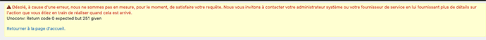

# Paramétrer CiviOffice
Les modèles de document sont nativement gérés par CiviCRM sous forme de messages html, ce qui est peu pratique. <br>

CiviOffice simplifie la gestion des modèles de documents en utilisant des maquettes word et des *tokens*. <br>

Pour paramétrer CiviOffice : **CiviOffice > CiviOffice settings**, modifiez :

* **CiviOffice Document Stores**
Configurez un **Local Folder** accessible par les utilisateurs. <br>
L'idéal est d'avoir un point de montage, par exemple *smb*, accessible par le serveur CiviCRM et par les utilisateurs appelés à modifier les modèles. 
* **CiviOffice Document Renderers (Converters) : Add Local Universal Converter**
    * *Nom* : unoconv <br>
    * *Path to the unoconv executable* : le chemin vers *unoconv*, que vous pouvez récuperer par ```which unoconv``` <br>
    * *Path to a lock file* : le chemin du ficher de lock
    > Attention ce fichier doit être modifiable par l'utisateur *www-data***
    * *Temporary directory* : répertoire temporaire, par ex. /tmp
    * *Use PHPWord macros for token replacement* : à cocher
    > Si tout va bien Ready to use passe à *oui*


> ATTENTION : CiviOffice utilise libre office qui ne doit pas tourner lorsque unoconv est lancé sinon vous obtiendrer l'erreur suivante (il suffit de quitter Libreoffice pour la supprimer):

